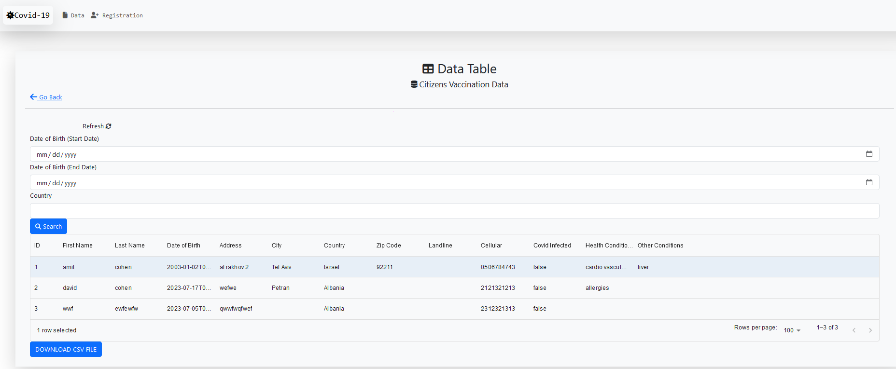
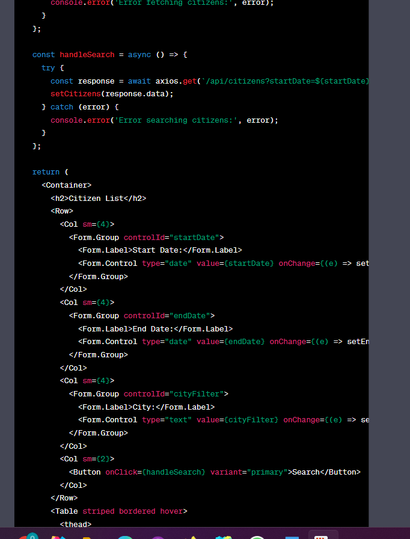

# VaxApp - Vaccination Registration Web Application

***


# Description

***

- registration page
  
- data page
  

## About the project

The VaxApp is a web application developed to help undeveloped countries collect data from citizens in order to
prioritize COVID-19 vaccination.
This app aim to handle dataBase about citizens and their COVID-19 vaccination status/other health conditions status.
Frontend is developed using React.js ,React-router,Bootstrap 5,and react-csv.
Backend is developed using Spring Boot, Beans, and JPA.
Database is developed using PostgreSQL.

## Table of Contents

- [Installation](#installation)
- [Run the project](#run-the-project)
- [Available Scripts](#available-scripts)
- [How we did the project](#how-we-did-the-project)
- [Usage](#usage)
- [Credits](#credits)
- [License](#license)

## installation

check if you have node.js installed by typing in the terminal:

```bash
node -v
```

if you don't have node.js installed, please install it from [here](https://nodejs.org/en/download/)

then, clone the repository to your local machine.

```bash
git clone https://github.com/olaib/VaxApp_Vaccination_Registration_App
```

then, navigate to the cloned repository and install the dependencies by typing in the terminal:

```bash
cd VaxApp_Vaccination_Registration_App
```

to install the dependencies in backend side(react), type in the terminal:

```bash
cd Backend
npm install
```

then open the following File Backend/settings.js and change the following:
SECRET_KEY - to your own secret key of postgresql database

## Run the project

make sure you are in the Backend folder, then type in the terminal:

```bash
cd Backend
npm start
```

## Available Scripts

In the project directory, you can run:

 ```bash
npm start
```

Runs the app in the development mode.\
Open [http://localhost:3000](http://localhost:3000) to view it in your browser.

The page will reload when you make changes.\
You may also see any lint errors in the console.

```bash
npm test
```

Launches the test runner in the interactive watch mode.\
See the section about [running tests](https://facebook.github.io/create-react-app/docs/running-tests) for more
information.

```bash
npm run build`
```

Builds the app for production to the `build` folder.\
It correctly bundles React in production mode and optimizes the build for the best performance.

The build is minified and the filenames include the hashes.\
Your app is ready to be deployed!

See the section about [deployment](https://facebook.github.io/create-react-app/docs/deployment) for more information.

```bash 
npm run eject
```

**Note: this is a one-way operation. Once you `eject`, you can't go back!**

If you aren't satisfied with the build tool and configuration choices, you can `eject` at any time. This command will
remove the single build dependency from your project.

Instead, it will copy all the configuration files and the transitive dependencies (webpack, Babel, ESLint, etc) right
into your project so you have full control over them. All of the commands except `eject` will still work, but they will
point to the copied scripts so you can tweak them. At this point you're on your own.

You don't have to ever use `eject`. The curated feature set is suitable for small and middle deployments, and you
shouldn't feel obligated to use this feature. However we understand that this tool wouldn't be useful if you couldn't
customize it when you are ready for it.

## How we did the project

here is our journey in developing the project using chatGpt and previous knowledge from a course of Internet Programming
we start creating the backend using spring boot and postgresql database, then we created the frontend using react.js
and bootstrap 5...

### Our knowledge before starting the project:

we have previous knowledge in java and spring boot from a course of **Internet Programming** in this semester, we learned:
- java and spring boot, jpa, beans
- react.js, react-router, bootstrap 5.
- mysql database
- we used *chatGpt* to help us in the project(that's the task of the exercise)
<hr/>

we used *stackoverflow* to help us in the project for some errors we faced, we used chatGpt too.

### Backend

we start by creating the backend using spring boot and postgresql database, we created the following entities:
citizen: to store the data of the citizens
we create some services and controllers to handle the requests from the frontend and send the data to the database
we used JPA to handle the database and the entities this jpa is used to create the tables in the database automatically

Some of the screenshots of the backend (we improved the backend later on):

- init spring app with postgresQL:
    
  

  

- create the citizen entity:
  
  

- create the citizen repository:
  

- create the citizen controller:
  
  

in controller, we handle errors using @ExceptionHandler annotation:
automatically handle exceptions thrown by request and the frontend will get the error message as a response, here is the
link to the documentation:
[handle-server-errors](https://docs.spring.io/spring-framework/docs/current/javadoc-api/org/springframework/web/bind/annotation/ExceptionHandler.html)
[

then we add the following dependencies to the pom.xml file:

- spring-boot-starter-data-jpa - to handle the database and the entities ,this jpa is used to create the tables in the
  database automatically
- postgresql - to handle the database
- lombok - to handle the getters and setters

* make sure to load maven changes:
  

then we add the following to the application.properties file:

### Frontend

before all we created a frontend folder(project) using react.js and bootstrap 5:

we created the necasseray folders and files for the frontend:

- assets for images
- components for the components of the frontend
- pages for the pages of the frontend, we created the following pages:
    - registration page - to handle the registration of the citizens see below first screenshot
    - data page - to handle the data of the citizens data table including download as csv file, see below second
      screenshot

then we created the frontend using react.js and bootstrap 5, we created the following components:

- Registration component: to handle the registration of the citizens
- Data component: to handle the data of the citizens data table including download as csv file
- Navbar component: to handle the navbar of the frontend

then we add in App.js the following:

- react-router-dom - to handle the routing of the frontend
- fontawesome - to handle the icons of the frontend
- react-bootstrap - to handle the bootstrap of the frontend
- we created a router to handle the routing of the frontend:
- *__/data__* - to handle the data of the citizens data table including download as csv file
- *__/registration__* - to handle the registration of the citizens

some of screenshots of the frontend:

- cruid table(we improved the frontend later on we used DataGrid(from material-ui which has more features like sort by
  column) instead of react-bootstrap table):
- 
- 

- registration page: see below first screenshot
- data page + csv download feature(bonus): see below second screenshot

we used react-csv to handle the csv download feature(bonus) to download the data table as csv file.

we resolve errors in the project
we used chatGpt to help us, and some was from our knowledge and stackoverflow som of
the errors we faced:

- using postgresql database with spring boot.
- errors in rendering the data table.
- errors in the server side.


## Learn More

You can learn more in
the [Create React App documentation](https://facebook.github.io/create-react-app/docs/getting-started).

To learn React, check out the [React documentation](https://reactjs.org/).

### Code Splitting

This section has moved
here: [https://facebook.github.io/create-react-app/docs/code-splitting](https://facebook.github.io/create-react-app/docs/code-splitting)

### Analyzing the Bundle Size

This section has moved
here: [https://facebook.github.io/create-react-app/docs/analyzing-the-bundle-size](https://facebook.github.io/create-react-app/docs/analyzing-the-bundle-size)

### Making a Progressive Web App

This section has moved
here: [https://facebook.github.io/create-react-app/docs/making-a-progressive-web-app](https://facebook.github.io/create-react-app/docs/making-a-progressive-web-app)

### Advanced Configuration

This section has moved
here: [https://facebook.github.io/create-react-app/docs/advanced-configuration](https://facebook.github.io/create-react-app/docs/advanced-configuration)

### Deployment

This section has moved
here: [https://facebook.github.io/create-react-app/docs/deployment](https://facebook.github.io/create-react-app/docs/deployment)

`npm run build` fails to minify

This section has moved
here: [https://facebook.github.io/create-react-app/docs/troubleshooting#npm-run-build-fails-to-minify](https://facebook.github.io/create-react-app/docs/troubleshooting#npm-run-build-fails-to-minify)

## Usage

___

start the frontend by typing in the terminal:

```bash
npm start
```

## Credits

___

1. [React.js](https://reactjs.org/)
2. [Spring Boot](https://spring.io/projects/spring-boot)
4. [react-csv](https://www.npmjs.com/package/react-csv)
5. [react-router](https://reactrouter.com/web/guides/quick-start)
6. [react-router-dom](https://www.npmjs.com/package/react-router-dom)
7. [react-router-bootstrap](https://www.npmjs.com/package/react-router-bootstrap)
8. [react-bootstrap](https://react-bootstrap.github.io/)
9. [react-bootstrap-icons](https://www.npmjs.com/package/react-bootstrap-icons)
10. [react-bootstrap-table-next](https://www.npmjs.com/package/react-bootstrap-table-next)
11. [react-bootstrap-table2-paginator](https://www.npmjs.com/package/react-bootstrap-table2-paginator)
12. [react-bootstrap-table2-filter](https://www.npmjs.com/package/react-bootstrap-table2-filter)
13. [react-bootstrap-table2-toolkit](https://www.npmjs.com/package/react-bootstrap-table2-toolkit)
14. [react-bootstrap-table2-editor](https://www.npmjs.com/package/react-bootstrap-table2-editor)
15. [react-bootstrap-table2-overlay](https://www.npmjs.com/package/react-bootstrap-table2-overlay)