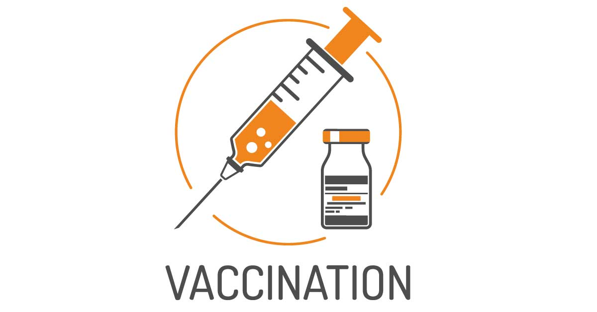
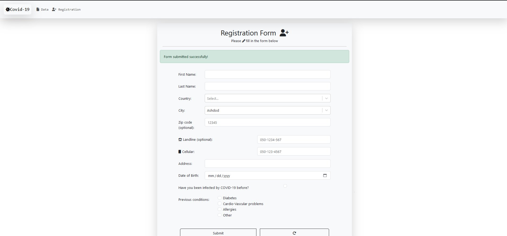
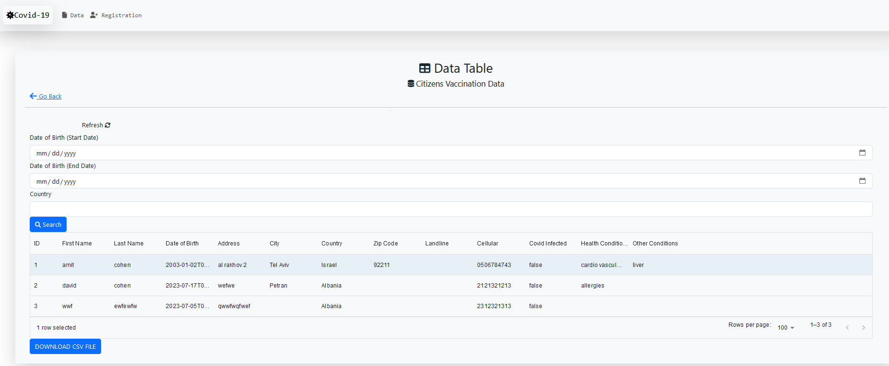

# VaxApp - Vaccination Registration Web Application

***


# Description

***



## About the project

The VaxApp is a web application developed to help undeveloped countries collect data from citizens in order to
prioritize COVID-19 vaccination.
This app aim to handle dataBase about citizens and their COVID-19 vaccination status/other health conditions status.
Frontend is developed using React.js ,React-router,Bootstrap 5,and react-csv.
Backend is developed using Spring Boot, Beans, and JPA.
Database is developed using PostgreSQL.

## Table of Contents

- [Installation](#installation)
- [Run the project](#run-the-project)
- [Available Scripts](#available-scripts)
- [How we did the project](#how-we-did-the-project)
- [Usage](#usage)
- [Credits](#credits)
- [License](#license)

## installation

check if you have node.js installed by typing in the terminal:

```bash
node -v
```

if you don't have node.js installed, please install it from [here](https://nodejs.org/en/download/)

then, clone the repository to your local machine.

```bash
git clone https://github.com/olaib/VaxApp_Vaccination_Registration_App
```

then, navigate to the cloned repository and install the dependencies by typing in the terminal:

```bash
cd VaxApp_Vaccination_Registration_App
```

to install the dependencies in backend side(react), type in the terminal:

```bash
cd Backend
npm install
```

then open the following File Backend/settings.js and change the following:
SECRET_KEY - to your own secret key of postgresql database

## Run the project

make sure you are in the Backend folder, then type in the terminal:

```bash
cd Backend
npm start
```

## Available Scripts

In the project directory, you can run:

 ```bash
npm start
```

Runs the app in the development mode.\
Open [http://localhost:3000](http://localhost:3000) to view it in your browser.

The page will reload when you make changes.\
You may also see any lint errors in the console.

```bash
npm test
```

Launches the test runner in the interactive watch mode.\
See the section about [running tests](https://facebook.github.io/create-react-app/docs/running-tests) for more
information.

```bash
npm run build`
```

Builds the app for production to the `build` folder.\
It correctly bundles React in production mode and optimizes the build for the best performance.

The build is minified and the filenames include the hashes.\
Your app is ready to be deployed!

See the section about [deployment](https://facebook.github.io/create-react-app/docs/deployment) for more information.

```bash 
npm run eject
```

**Note: this is a one-way operation. Once you `eject`, you can't go back!**

If you aren't satisfied with the build tool and configuration choices, you can `eject` at any time. This command will
remove the single build dependency from your project.

Instead, it will copy all the configuration files and the transitive dependencies (webpack, Babel, ESLint, etc) right
into your project so you have full control over them. All of the commands except `eject` will still work, but they will
point to the copied scripts so you can tweak them. At this point you're on your own.

You don't have to ever use `eject`. The curated feature set is suitable for small and middle deployments, and you
shouldn't feel obligated to use this feature. However we understand that this tool wouldn't be useful if you couldn't
customize it when you are ready for it.

## How we did the project

please check the  [HELP.md](HELP.md)

## Learn More

You can learn more in
the [Create React App documentation](https://facebook.github.io/create-react-app/docs/getting-started).

To learn React, check out the [React documentation](https://reactjs.org/).

### Code Splitting

This section has moved
here: [https://facebook.github.io/create-react-app/docs/code-splitting](https://facebook.github.io/create-react-app/docs/code-splitting)

### Analyzing the Bundle Size

This section has moved
here: [https://facebook.github.io/create-react-app/docs/analyzing-the-bundle-size](https://facebook.github.io/create-react-app/docs/analyzing-the-bundle-size)

### Making a Progressive Web App

This section has moved
here: [https://facebook.github.io/create-react-app/docs/making-a-progressive-web-app](https://facebook.github.io/create-react-app/docs/making-a-progressive-web-app)

### Advanced Configuration

This section has moved
here: [https://facebook.github.io/create-react-app/docs/advanced-configuration](https://facebook.github.io/create-react-app/docs/advanced-configuration)

### Deployment

This section has moved
here: [https://facebook.github.io/create-react-app/docs/deployment](https://facebook.github.io/create-react-app/docs/deployment)

`npm run build` fails to minify

This section has moved
here: [https://facebook.github.io/create-react-app/docs/troubleshooting#npm-run-build-fails-to-minify](https://facebook.github.io/create-react-app/docs/troubleshooting#npm-run-build-fails-to-minify)

## Usage

___

start the frontend by typing in the terminal:

```bash
npm start
```

## Credits

___

1. [React.js](https://reactjs.org/)
2. [Spring Boot](https://spring.io/projects/spring-boot)
4. [react-csv](https://www.npmjs.com/package/react-csv)
5. [react-router](https://reactrouter.com/web/guides/quick-start)
6. [react-router-dom](https://www.npmjs.com/package/react-router-dom)
7. [react-router-bootstrap](https://www.npmjs.com/package/react-router-bootstrap)
8. [react-bootstrap](https://react-bootstrap.github.io/)
9. [react-bootstrap-icons](https://www.npmjs.com/package/react-bootstrap-icons)
10. [react-bootstrap-table-next](https://www.npmjs.com/package/react-bootstrap-table-next)
11. [react-bootstrap-table2-paginator](https://www.npmjs.com/package/react-bootstrap-table2-paginator)
12. [react-bootstrap-table2-filter](https://www.npmjs.com/package/react-bootstrap-table2-filter)
13. [react-bootstrap-table2-toolkit](https://www.npmjs.com/package/react-bootstrap-table2-toolkit)
14. [react-bootstrap-table2-editor](https://www.npmjs.com/package/react-bootstrap-table2-editor)
15. [react-bootstrap-table2-overlay](https://www.npmjs.com/package/react-bootstrap-table2-overlay)